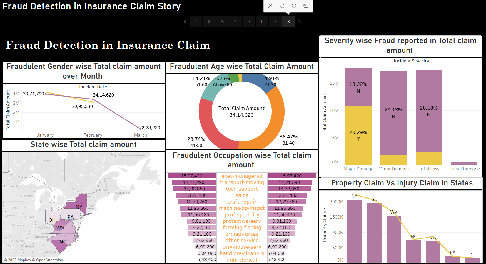

# 🛡️ Insurance Fraud Detection Dashboard - Tableau Project

This is a data visualization project built using **Tableau** to explore and analyze patterns in **insurance fraud claims**. The dashboard aims to help insurance analysts identify potential fraud, observe trends, and make data-driven decisions.

---

## 🎯 Project Objective

To detect and visualize fraudulent insurance claims by analyzing:
- Claim characteristics
- Demographic information
- Policy details
- Fraud indicators

---

## 🗂️ Project Structure
Insurance-Fraud-Detection-Project/
├── README.md
├── dataset/
│ └── insurance_claims.csv
├── images/
│ └── dashboard_screenshot.png
├── tableau/
│ └── insurance_dashboard.twbx

## 📊 Key Dashboard Insights

- 📌 Total number of claims and % of frauds
- 🧍‍♀️ Gender-wise fraud distribution
- 🏢 Fraud by incident type and claim reason
- 🌍 Regional pattern of fraudulent claims
- 💰 Financial impact (total fraud claim amount)

---

## 🛠 Tools & Technologies Used

- **Tableau Public**
- **CSV Dataset** (`insurance_claims.csv`)

---

## 🖼️ Dashboard Preview

---

## 📁 Dataset Source

> The dataset used in this project is publicly available on Kaggle.  

---

## 🚀 How to Use

1. Download the `insurance_dashboard.twbx` file from the `tableau/` folder.
2. Open it using **Tableau Public Desktop**.
3. Explore filters and visualizations interactively.

---

## 👩‍💻 Author

**Bhoomika Jaiswal**  
B.Tech CSE | Data Science Specialization  
Lovely Professional University  
[https://www.linkedin.com/in/bhoomika-jaiswal/]  
[bhoomikajaiswal0611@gmail.com]

